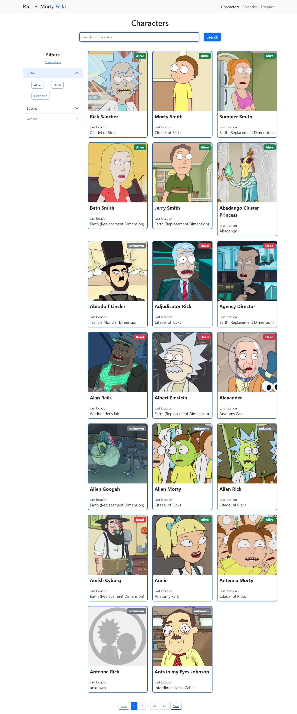
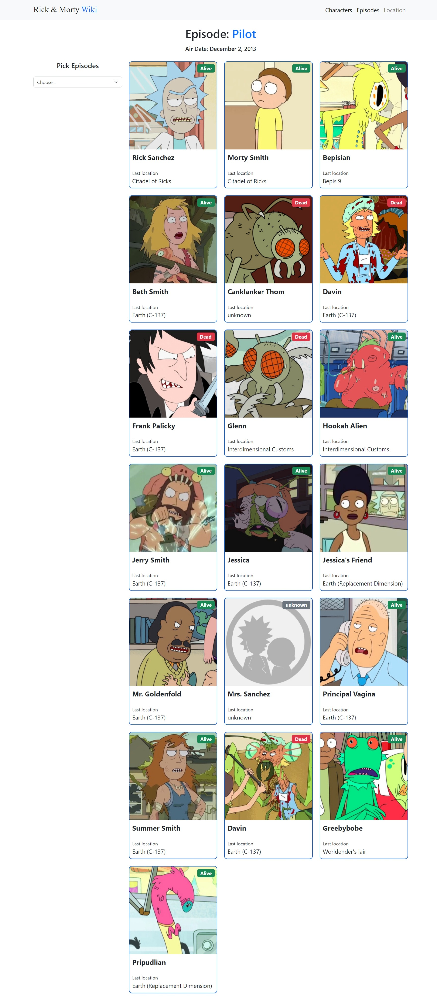
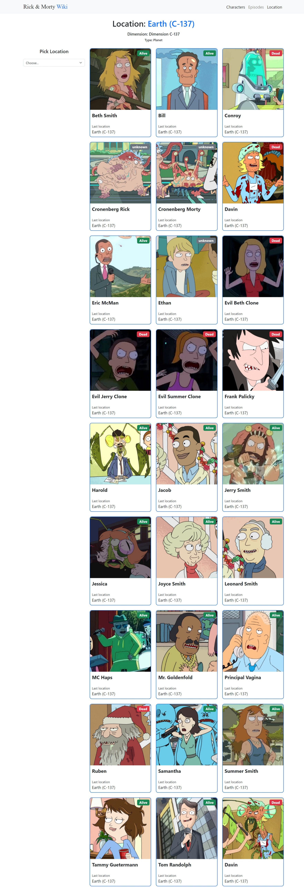

# Rick and Morty API
This design is inspired by the work of [Joy Shaheb](https://www.youtube.com/@JoyShaheb). Click [here](https://youtu.be/35QCQnohLg8?si=N_HZBDxinHVXTh3P) to watch the video.

## Technologies
This web page was made with the following technologies:
- HTML5
- CSS3
- JavaScript
- SASS
- Bootstrap
- React
- React Router
- React Paginate
- GH-pages

## Pages
This project contains 3 sections: **Characters**, **Episodes** and **Location**.

### Characters
#### In this view, characters from 'Rick and Morty' are displayed. A search bar is available for users to find their desired character. Additionally, a filter section is located on the right side, allowing users to filter characters by status (alive, dead, or unknown), species type, and gender. At the bottom of the page, a pagination feature is provided, enabling users to navigate to the next page and load more characters.

### Episodes
#### In this alternate view, characters from the selected episode of ‘Rick and Morty’ are showcased. An episode selection feature is conveniently located on the right side. Upon choosing an episode, the characters featured in that specific episode will be loaded and displayed.

### Location
#### In the location view, characters associated with the selected location are showcased. An interactive feature on the right side allows users to select an episode. Upon selection, characters from the chosen episode who are associated with the selected location will be displayed.

